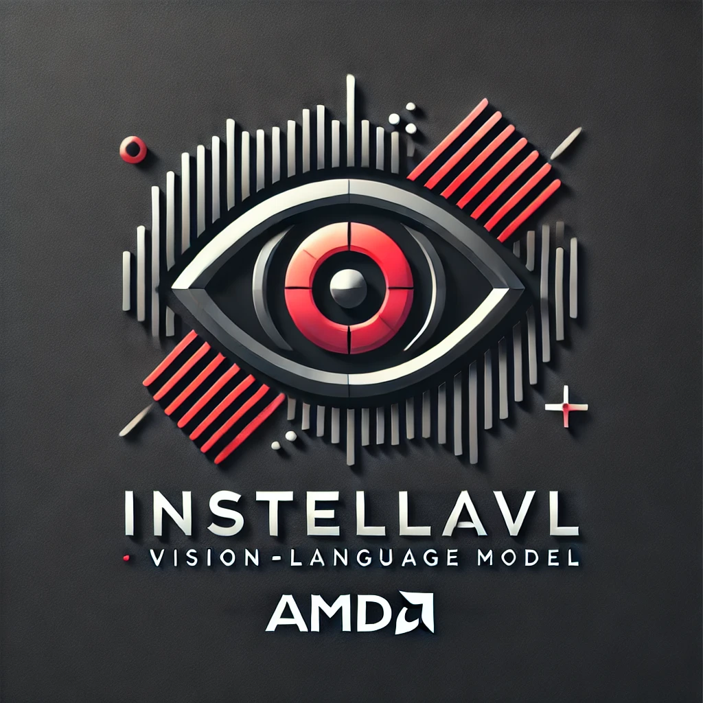

<div align="center">
  
  <br>
  <br>
  <h1>Instella-VL-1B✨: AMD's first Vision-Language Model</h1>
</div>
<p align="center">
  <a href='https://huggingface.co/amd/Instella-VL-1B'></a>
<a href='./blog/blog-final.md'></a> 
  </a>
</p>

Welcome to the official repository for **Instella-VL-1B**, AMD's first ever Vision-Language Model (VLM). This repository provides a detailed guide for training and inference with **Instella-VL-1B**. Developed from AMD's **Instella-1B** (previously known as [AMD OLMo 1B SFT](https://www.amd.com/en/developer/resources/technical-articles/introducing-the-first-amd-1b-language-model.html) LLM), this model is fully open-source, with both model weights and training code available for AMD GPUs (MI300). Its compact size aims to make it accessible to a broad spectrum of researchers, developers, and enthusiasts, enabling them to build upon, modify, and integrate it into their own projects.

In this repository, you'll find everything you need to get started with **Instella-VL-1B**, including detailed documentation, example code, and best practices for both training and inference.


## :trophy: Main Results
<!-- |  | TinyLLaVA-1.5B | TinyLLaVA-2.4B | DeepSeek-VL-1.3B | llava-onevision-1b | InternVL2-1B  | MiniCPM-V-2 (2.8B) |  Instella-VL-1B |  
 |------------:|:--------------:|:---------:|:--------------:|:------:|:---------------------:|:---------------------:|:---------------------:| 
| GQA   | 60.28 | 61.58| - | 57.95 | 55.06 | - | 61.52
| ScienceQA (Image)  | 59.69 | 64.30 | 64.52 | 59.25 | 89.54 | 76.10 | 83.74
| POPE   | 84.77 | 85.66 | 85.80 | 87.17 | 87.40 | 86.56 | 86.73
| MM-Bench-EN | 51.28 | 58.16 | 64.34 |  52.06 | 62.97 | 70.44 | 66.65
| SeedBench (Image)  | 60.04 | 58.16 | 65.94 | 65.43 | 65.90 | 66.90 | 68.47
| MMMU   | 29.89 | 63.30 | 28.67  | 31.22 | 34.89 | 38.55 | 32.22
| realworldqa   | 46.67 | 52.42 | 50.20 | 51.63 | 51.90 | 55.03 | 58.82
| mmstar  | 31.87 | 37.17 | 38.30 | 37.38 | 46.18 | 40.93 | 43.21
| OCRBench   | 34.40 | 28.90 | 41.40 | 43.00 | 74.40 | 60.00 | 67.90
| TextVQA  | 49.54 | 47.05 | 57.54 | 49.54 | 69.60 | 74.23 | 71.23
| AI2D  | 43.10 | 49.58 | 51.13 | 57.35 | 62.40 | 64.40 | 66.65
| ChartQA  | 15.24 | 12.96 | 47.40 | 61.24 | 71.52 | 59.80 | 72.52
| DocVQA  | 30.38 | 25.82 | 35.70| 73.85 | 81.92 | 69.54 | 82.93
| InfoVQA | 24.46 | 21.35 | 20.52| 45.89 | 52.27 | 38.24 | 53.55 -->


<!-- <style type="text/css">
.tg  {border-collapse:collapse;border-spacing:0;}
.tg td{border-color:black;border-style:solid;border-width:1px;font-family:Arial, sans-serif;font-size:14px;
  overflow:hidden;padding:10px 5px;word-break:normal;}
.tg th{border-color:black;border-style:solid;border-width:1px;font-family:Arial, sans-serif;font-size:14px;
  font-weight:normal;overflow:hidden;padding:10px 5px;word-break:normal;}
.tg .tg-c3ow{border-color:inherit;text-align:center;vertical-align:top}
.tg .tg-0pky{border-color:inherit;text-align:left;vertical-align:top}
</style> -->
We compare our model with models which partially releases the training details (with * in the below table) and also models which releases weights, data curation and all training details.

<table class="tg"><thead>
  <tr>
    <td class="tg-0pky"></td>
    <td class="tg-c3ow">DeepSeek-VL-1.3B *</td>
    <td class="tg-c3ow">InternVL2-1B *</td>
    <td class="tg-c3ow">InternVL2.5-1B *</td>
    <td class="tg-c3ow">TinyLLaVA-2.4B</td>
    <td class="tg-c3ow">TinyLLaVA-1.5B</td>
    <td class="tg-c3ow">llava-onevision-1b</td>
    <td class="tg-c3ow">MiniCPM-V-2</td>
    <td class="tg-c3ow">Instella-VL-1B</td>
  </tr></thead>
<tbody>
  <tr>
    <td class="tg-c3ow">GQA</td>
    <td class="tg-c3ow">--</td>
    <td class="tg-c3ow">55.06</td>
    <td class="tg-c3ow">56.66</td>
    <td class="tg-c3ow">61.58</td>
    <td class="tg-c3ow">60.28</td>
    <td class="tg-c3ow">57.95</td>
    <td class="tg-c3ow">--</td>
    <td class="tg-c3ow">61.52</td>
  </tr>
  <tr>
    <td class="tg-c3ow">SQA</td>
    <td class="tg-c3ow">64.52</td>
    <td class="tg-c3ow">89.54</td>
    <td class="tg-c3ow">93.90</td>
    <td class="tg-c3ow">64.30</td>
    <td class="tg-c3ow">59.69</td>
    <td class="tg-c3ow">59.25</td>
    <td class="tg-c3ow">76.10</td>
    <td class="tg-c3ow">83.74</td>
  </tr>
  <tr>
    <td class="tg-c3ow">POPE</td>
    <td class="tg-c3ow">85.80</td>
    <td class="tg-c3ow">87.40</td>
    <td class="tg-c3ow">89.95</td>
    <td class="tg-c3ow">85.66</td>
    <td class="tg-c3ow">84.77</td>
    <td class="tg-c3ow">87.17</td>
    <td class="tg-c3ow">86.56</td>
    <td class="tg-c3ow">86.73</td>
  </tr>
  <tr>
    <td class="tg-c3ow">MM-Bench</td>
    <td class="tg-c3ow">64.34</td>
    <td class="tg-c3ow">61.70</td>
    <td class="tg-c3ow">68.40</td>
    <td class="tg-c3ow">58.16</td>
    <td class="tg-c3ow">51.28</td>
    <td class="tg-c3ow">44.60</td>
    <td class="tg-c3ow">70.44</td>
    <td class="tg-c3ow">69.17</td>
  </tr>
  <tr>
    <td class="tg-c3ow">seedbench</td>
    <td class="tg-c3ow">65.94</td>
    <td class="tg-c3ow">65.90</td>
    <td class="tg-c3ow">71.30</td>
    <td class="tg-c3ow">63.30</td>
    <td class="tg-c3ow">60.04</td>
    <td class="tg-c3ow">65.43</td>
    <td class="tg-c3ow">66.90</td>
    <td class="tg-c3ow">68.47</td>
  </tr>
  <tr>
    <td class="tg-c3ow">MMMU</td>
    <td class="tg-c3ow">28.67</td>
    <td class="tg-c3ow">32.40</td>
    <td class="tg-c3ow">35.60</td>
    <td class="tg-c3ow">32.11</td>
    <td class="tg-c3ow">29.89</td>
    <td class="tg-c3ow">30.90</td>
    <td class="tg-c3ow">38.55</td>
    <td class="tg-c3ow">29.30</td>
  </tr>
  <tr>
    <td class="tg-c3ow">realworldqa</td>
    <td class="tg-c3ow">50.20</td>
    <td class="tg-c3ow">51.90</td>
    <td class="tg-c3ow">58.30</td>
    <td class="tg-c3ow">52.42</td>
    <td class="tg-c3ow">46.67</td>
    <td class="tg-c3ow">51.63</td>
    <td class="tg-c3ow">55.03</td>
    <td class="tg-c3ow">58.82</td>
  </tr>
  <tr>
    <td class="tg-c3ow">mmstar</td>
    <td class="tg-c3ow">38.30</td>
    <td class="tg-c3ow">46.18</td>
    <td class="tg-c3ow">47.93</td>
    <td class="tg-c3ow">37.17</td>
    <td class="tg-c3ow">31.87</td>
    <td class="tg-c3ow">37.38</td>
    <td class="tg-c3ow">40.93</td>
    <td class="tg-c3ow">43.21</td>
  </tr>
  <tr>
    <td class="tg-c3ow"><span style="font-weight:bold">Average</span></td>
    <td class="tg-c3ow">-</td>
    <td class="tg-c3ow">61.26</td>
    <td class="tg-c3ow">65.26</td>
    <td class="tg-c3ow">56.84</td>
    <td class="tg-c3ow">53.06</td>
    <td class="tg-c3ow">54.29</td>
    <td class="tg-c3ow">-</td>
    <td class="tg-c3ow">62.62</td>
  </tr>
  <tr>
    <td class="tg-c3ow">ocrbench</td>
    <td class="tg-c3ow">41.40</td>
    <td class="tg-c3ow">74.40</td>
    <td class="tg-c3ow">74.20</td>
    <td class="tg-c3ow">28.90</td>
    <td class="tg-c3ow">34.40</td>
    <td class="tg-c3ow">43.00</td>
    <td class="tg-c3ow">60.00</td>
    <td class="tg-c3ow">67.90</td>
  </tr>
  <tr>
    <td class="tg-c3ow">TextVQA</td>
    <td class="tg-c3ow">57.54</td>
    <td class="tg-c3ow">69.60</td>
    <td class="tg-c3ow">72.96</td>
    <td class="tg-c3ow">47.05</td>
    <td class="tg-c3ow">49.54</td>
    <td class="tg-c3ow">49.54</td>
    <td class="tg-c3ow">74.23</td>
    <td class="tg-c3ow">71.23</td>
  </tr>
  <tr>
    <td class="tg-c3ow">AI2D</td>
    <td class="tg-c3ow">51.13</td>
    <td class="tg-c3ow">62.40</td>
    <td class="tg-c3ow">67.58</td>
    <td class="tg-c3ow">49.58</td>
    <td class="tg-c3ow">43.10</td>
    <td class="tg-c3ow">57.35</td>
    <td class="tg-c3ow">64.40</td>
    <td class="tg-c3ow">66.65</td>
  </tr>
  <tr>
    <td class="tg-c3ow">ChartQA</td>
    <td class="tg-c3ow">47.40</td>
    <td class="tg-c3ow">71.52</td>
    <td class="tg-c3ow">75.76</td>
    <td class="tg-c3ow">12.96</td>
    <td class="tg-c3ow">15.24</td>
    <td class="tg-c3ow">61.24</td>
    <td class="tg-c3ow">59.80</td>
    <td class="tg-c3ow">72.52</td>
  </tr>
  <tr>
    <td class="tg-c3ow">DocVQA</td>
    <td class="tg-c3ow">35.70</td>
    <td class="tg-c3ow">80.94</td>
    <td class="tg-c3ow">82.76</td>
    <td class="tg-c3ow">25.82</td>
    <td class="tg-c3ow">30.38</td>
    <td class="tg-c3ow">71.22</td>
    <td class="tg-c3ow">69.54</td>
    <td class="tg-c3ow">80.30</td>
  </tr>
  <tr>
    <td class="tg-c3ow">InfoVQA</td>
    <td class="tg-c3ow">20.52</td>
    <td class="tg-c3ow">46.30</td>
    <td class="tg-c3ow">53.62</td>
    <td class="tg-c3ow">21.35</td>
    <td class="tg-c3ow">24.46</td>
    <td class="tg-c3ow">41.18</td>
    <td class="tg-c3ow">38.24</td>
    <td class="tg-c3ow">46.40</td>
  </tr>
  <tr>
    <td class="tg-c3ow">OCR Average</td>
    <td class="tg-c3ow">42.28</td>
    <td class="tg-c3ow">67.53</td>
    <td class="tg-c3ow">71.15</td>
    <td class="tg-c3ow">30.94</td>
    <td class="tg-c3ow">32.85</td>
    <td class="tg-c3ow">53.92</td>
    <td class="tg-c3ow">61.04</td>
    <td class="tg-c3ow">67.50</td>
  </tr>
</tbody></table>


## :gear: SetUp

### :fire: PyTorch on AMD GPUs - with `ROCm` support

Use the [Dockerfile](./Dockerfile) as well as [.dockerignore](./.dockerignore) to build the image as shown below. 
 ```bash
 # Assuming you are inside the InstellaVL repo
 # Save build logs at build_instella.log. Use --no-cache before -t to build fresh.
 docker build -t instellavl_image:latest . > build_instella.log 2>&1
 # Save the image at some common/shared storage space
 docker save -o /path/to/common-space/instellavl.rar instellavl_image:latest
 ```

Load the above image as interactive docker container.
```bash
# Load docker
docker load -i /path/to/common-space/instellavl.rar
# Now 
docker run -it \ 
  --gpus all \ 
  --network=host \ 
  --device=/dev/kfd \ 
  --device=/dev/dri \ 
  --device=/dev/infiniband \ 
  --group-add=video \ 
  --ipc=host \ 
  --cap-add=SYS_PTRACE \ 
  --security-opt seccomp=unconfined \ 
  --privileged -v /cephfs:/cephfs \ 
  --shm-size 8G \ 
  --name="instellavl_container" \
  rocm/instellavl:latest \
  /bin/bash
```
This assist us with multinode docker training, ROCm powered **[bitsandbytes](https://github.com/ROCm/bitsandbytes/tree/main)**, **[flash-attention-v2](https://github.com/ROCm/flash-attention)**, and **[apex](https://github.com/ROCm/apex)**.


> [!IMPORTANT]
> 1. Additional manual setup required ([read this :point_left:](./docs/additional_setup.md)) for the evaluation toolkit, [`lmms-eval`](https://github.com/EvolvingLMMs-Lab/lmms-eval) for evaluation of Instella-VL-1B.
>
> 2. Set your credentials in [`.env`](./.env) file.

> [!TIP]
> If you modify any code files (e.g., `*.py` scripts) for debugging purposes, ensure that the changes are reflected in the Docker environment. To do this, execute the following command inside the `InstellaVL` folder in the Docker bash terminal:
> ```bash
> pip install -e . --no-deps
> ```


## :robot: Inference

> [!NOTE]
> Follow [inference_requirements.txt](./inference_requirements.txt) for setting up the environment.

### :floppy_disk: Loading from locally saved checkpoint

> [!NOTE]
> Additionally do `pip install -e . --no-deps` to register/include for InstellaVL repo as `instellavl` package into python package list.

``` python
import torch

# Import essential modules
from instellavl.constants import DEFAULT_IMAGE_TOKEN, IMAGE_TOKEN_INDEX
from instellavl.conversation import conv_templates, SeparatorStyle
from instellavl.model.builder import load_pretrained_model
from instellavl.utils import disable_torch_init
from instellavl.mm_utils import process_images, tokenizer_image_token, get_model_name_from_path

from PIL import Image

import requests
from io import BytesIO

# Login into HF Hub
from huggingface_hub import login
login(token = "<Your HFtoken id>") # Enter your token 

def load_image(image_file):
    if image_file.startswith("http") or image_file.startswith("https"):
        response = requests.get(image_file)
        image = Image.open(BytesIO(response.content)).convert("RGB")
    else:
        image = Image.open(image_file).convert("RGB")
    return image

#
# ========= CHANGE IMAGE and Query only HERE ============
image_file = '/path/to/InstellaVL-repo/assets/images/example2_dog.jpg' # Enter the test image path
query = 'Describe this image.'
# =======================================================

disable_torch_init()
conv_mode = 'instella'

# Model loading
model_path = '<path/to/model-checkpoint-saved-locally>' # Enter your model path, should contain instellavl substring in the name.
model_name = get_model_name_from_path(model_path)
tokenizer, model, image_processor, context_len = load_pretrained_model(model_path, None, model_name, False, False)
model.eval()
model = model.to('cuda') # change to 'cpu' if not 'cuda'

# Image pre-processing
image = load_image(image_file)
image_tensor = process_images([image], image_processor, model.config)
image_tensor = image_processor.preprocess(image, return_tensors="pt")["pixel_values"].to(model.dtype)

# Text pre-processing - follow the below logic too when there is no Image:
# if images is not None and len(image_tensor) != 0 and DEFAULT_IMAGE_TOKEN not in text:
#     question = DEFAULT_IMAGE_TOKEN + "\n" + text
# else:
#     question = text
query = query.replace(DEFAULT_IMAGE_TOKEN, "").strip()
question = DEFAULT_IMAGE_TOKEN + "\n" + query
conv = conv_templates[conv_mode].copy()
conv.append_message(conv.roles[0], question)
conv.append_message(conv.roles[1], None)
prompt_question = conv.get_prompt()

# Final arrangements required
input_ids = tokenizer_image_token(prompt_question, tokenizer, IMAGE_TOKEN_INDEX, return_tensors="pt").unsqueeze(0)
keywords = [conv.sep]
image_sizes = [image.size]
stopping_criteria = [KeywordsStoppingCriteria(keywords, tokenizer, input_ids)]
terminators = [tokenizer.eos_token_id, tokenizer.convert_tokens_to_ids("|||IP_ADDRESS|||")]

with torch.inference_mode():
    output_ids = model.generate(input_ids.to(model.device), images=image_tensor.to(model.device), image_sizes=image_sizes, do_sample=True, num_beams=1, temperature=0.2, max_new_tokens=1024, use_cache=True, stopping_criteria=stopping_criteria, eos_token_id=terminators)

outputs = tokenizer.decode(output_ids[0, input_ids.shape[1] :]).strip()
print("InstellaVL: ", outputs)
``` 
### :inbox_tray: Load Model from Huggingface

```python
import os
import torch
from transformers import AutoTokenizer, AutoProcessor, AutoConfig, AutoModelForCausalLM

from PIL import Image
import requests
from io import BytesIO

def load_image(image_file):
    if image_file.startswith("http") or image_file.startswith("https"):
        response = requests.get(image_file)
        image = Image.open(BytesIO(response.content)).convert("RGB")
    else:
        image = Image.open(image_file).convert("RGB")
    return image


config = AutoConfig.from_pretrained("amd/Instella-VL-1B", trust_remote_code=True)
tokenizer = AutoTokenizer.from_pretrained("amd/Instella-VL-1B", config=config, trust_remote_code=True)
processor = AutoProcessor.from_pretrained("amd/Instella-VL-1B", trust_remote_code=True)
model = AutoModelForCausalLM.from_pretrained("amd/Instella-VL-1B", trust_remote_code=True).to('cuda') # or 'cpu'
model.eval()

query="Describe the image."
image=load_image("path/to/your_image")
out = processor.encode(query, image, model.get_vision_tower().image_processor, tokenizer, config)
inputs = {k: v.to(model.device) for k, v in out.items() if isinstance(v, torch.Tensor)}
with torch.inference_mode():
    output_ids = model.generate(inputs["input_ids"], images=inputs['image_tensor'], image_sizes=out['image_sizes'], do_sample=True, num_beams=1, temperature=0.2, max_new_tokens=1024, use_cache=True, stopping_criteria=out['stopping_criteria'], eos_token_id=out['eos_token_id'])
outputs = processor.decode(output_ids)
print("InstellaVL: ", outputs)
```

## :building_construction: Model Architecture

| Parts        | Parameter size   | Number of layers  | Number of heads	| Hidden size	| Patch Size  |
| ------------- |:-------------:|:-----:|:-----:|:-----:|:-----:|
| Vision Encoder | 300M | 24|  16 | 1024 | 14 |
| MLP | 6.3M | 2 | - | 2048 | - |
| LM | 1.2B | 16 |	16 |	2048 |	- |

> [!NOTE]
> We initialize the vision encoder from [CLIP-ViT-L/14@336](https://huggingface.co/openai/clip-vit-large-patch14-336) and initialize LM from [AMD OLMo 1B SFT](https://huggingface.co/AIG-GenAI/AMD-OLMo-1B-SFT)


## :chart_with_upwards_trend: Training Stages

| Stages        | MLP Warmup           | Pretraining  | Instruction Tuning  |
| ------------- |:-------------:|:-----:|:-----:|
| Tunable Parts | Adapter | Entire Model | Entire Model |
| Batch Size  | 256 | 256 | 256
| Learning Rate | 1e-3 | 1e-5 | 1e-5|
| Context Length | 8192 | 32768 | 32768 | 
| Input Image Size | (336,336) | ((336,336)) x [(1, 1), (1, 2), (2, 1), (2, 2), (3, 1), (1, 3), (1, 4), (4, 1), (1, 5), (5, 1)] || 
| Weight Decay | 0. | 0. | 0. |
| Warmup Ratio | 0.03 | 0.03 | 0.03 |
| Epochs | 1 | 1 | 2 |

## :control_knobs: Hardware
Each node has 8 AMD MI300 GPU cards.  
**MLP warmup**: 1 node  
**Pretraining**: 2 nodes  
**Finetune**: 4 nodes 

## :repeat: Reproducibility

### :weight_lifting: Training

We have 3 stages of training:

1. **MLP Warmup**: Warmimg up the 2-layer MLP projector (otherwise known as Adapter) while keeping other components frozen. To do the same, we used `BLIP558k` dataset.
2. **Pretraining**: The entire model is pre-trained in NTP (Next-Token Prediction) fashion on various Image-Caption datasets. Details to datasets used can be found in the table below.
3. **SFT**: In this final stage of Supervised Fine-Tuning, we emphasized upon instruction following ability of the model using several vision instruction datasets spanning across various domains. Further details mentioned below.

> [!CAUTION]
> All the checkpoints name (whether its Adapter generated during WarmUp, PT checkpoint during Pre-Training, or final checkpoint from SFT) should include `instellavl`.

> [!IMPORTANT]
> The training strategy for all three stages are provided at **[Training Documentation](./docs/training_readme.md)**.

<h3 align="center">Pretraining Stage</h3>

| **Domain** | **Datasets** | **Num of Examples** | **Licenses** |
|---|:---:|---:|:---|
| Image Captions | [BLIP150K](https://huggingface.co/datasets/liuhaotian/LLaVA-Pretrain), [COCO118K](https://huggingface.co/datasets/liuhaotian/LLaVA-Pretrain), [CC3M-Recap](https://huggingface.co/datasets/lmms-lab/LLaVA-ReCap-CC3M),  [Pixmo_Cap](https://huggingface.co/datasets/allenai/pixmo-cap) | 3.52M | BSD 3-Clause for BLIP150K, COCO118K; Apache 2 for CC3M-Recap; ODC-BY-1.0 for Pixmo_Cap; see source materials for CC3M-Recap |
| OCR | [SynthDog_EN](https://huggingface.co/datasets/lmms-lab/LLaVA-OneVision-Mid-Data), [SynthDog_ZH](https://huggingface.co/datasets/lmms-lab/LLaVA-OneVision-Mid-Data), [UReader](https://huggingface.co/datasets/lmms-lab/LLaVA-OneVision-Mid-Data), [ART](https://rrc.cvc.uab.es/?ch=14&com=downloads), [COCO-Text](https://bgshih.github.io/cocotext/), [HierText](https://github.com/google-research-datasets/hiertext), [Uber-Text](https://s3-us-west-2.amazonaws.com/uber-common-public/ubertext/index.html), [TextOCR](https://huggingface.co/datasets/lmms-lab/LLaVA-OneVision-Data), [OpenVINO](https://github.com/openvinotoolkit/cvat), [MLT-17](https://rrc.cvc.uab.es/?ch=8&com=downloads) | 913K | Apache 2 for SynthDog_EN, SynthDog_ZH, UReader, TextOCR, OpenVINO; CC By 4.0 for COCO-Text; CC BY-SA 4.0 for HierText, Uber-Text; See source materials for ART, MLT-17 |
| Doc | [DocVQA](https://huggingface.co/datasets/lmms-lab/LLaVA-OneVision-Data), [DocStruct4M](https://huggingface.co/datasets/mPLUG/DocStruct4M) | 410K | Apache 2 |
| Table & Chart & Plot | [Chart2Text](https://github.com/vis-nlp/Chart-to-text/tree/main/pew_dataset/dataset/imgs), [UniChart](https://huggingface.co/datasets/ahmed-masry/unichart-pretrain-data), [PlotQA](https://huggingface.co/datasets/lmms-lab/LLaVA-OneVision-Data), [WidgetCaption](https://huggingface.co/datasets/rootsautomation/RICO-WidgetCaptioning?row=0), [Screen2Words](https://huggingface.co/datasets/rootsautomation/RICO-Screen2Words), [SciGraphQA-295K](https://huggingface.co/datasets/alexshengzhili/SciGraphQA-295K-train), [Paper2Fig100K](https://zenodo.org/records/7299423#.Y2lzonbMKUl), [MMC Instruction](https://huggingface.co/datasets/xywang1/MMC/viewer/MMC-Instruction), [M-Paper](https://huggingface.co/datasets/mPLUG/M-Paper) | 1.97M | GPL-3.0 for Chart2Text; MIT for UniChart, SciGraphQA-295K; Apache 2 for PlotQA, M-Paper; CC By 4.0 for WidgetCaption, Screen2Words, Paper2Fig100K; CC BY-SA 4.0 for MMC Instruction |
| Text Only | [Evol-Instruct-GPT-4](https://huggingface.co/datasets/lmms-lab/LLaVA-OneVision-Mid-Data/tree/main/evol_instruct) | 70K | Apache 2 |

<h3 align="center">Instruction-tuning Stage</h3>

| **Domain** | **Datasets** | **Num of Examples** | **Licenses** |
|---|:---:|---:|:---|
| General | [AOKVQA, CLEVR, Hateful Memes, Image Textualization, OKVQA, ScienceQA, ShareGPT-4V, TallyQA, Visual7W, VizWiz, VQAv2, WebSight, ALLaVA Instruct, Cambrian, COCO Caption, IconQA, LLaVA-158K, LLaVAR, RefCOCO, ShareGPT-4O, Vision FLAN, VisText, VQARAD, VSR, InterGPS](https://huggingface.co/datasets/lmms-lab/LLaVA-OneVision-Data), [Image-Paragraph-Captioning, ImageNet, COCO-GOI, COCO-ITM, Visual Dialog, SNLI-VE](https://huggingface.co/datasets/MMInstruction/M3IT), [Web-Landmark, Web-Celebrity, SAM, LAION-GPT-4V-Dataset, OODVQA]( https://huggingface.co/datasets/nyu-visionx/Cambrian-10M/tree/main), [Pixmo_Cap](https://huggingface.co/datasets/allenai/pixmo-cap), [Pixmo_Count](https://huggingface.co/datasets/allenai/pixmo-count), [Pixmo_Points](https://huggingface.co/datasets/allenai/pixmo-points), [Pixmo_Ask_Model_Anything](https://huggingface.co/datasets/allenai/pixmo-ask-model-anything),   [SVIT_Core_150K](https://huggingface.co/datasets/BAAI/SVIT), [Localized Narratives](https://huggingface.co/datasets/HuggingFaceM4/the_cauldron) | 2.66M | see source materials for Image-Paragraph-Captioning, ImageNet, COCO-GOI, COCO-ITM, Visual Dialog, SNLI-VE; ODC-BY-1.0 for Pixmo_Cap, Pixmo_Count, Pixmo_Points, Pixmo_Ask_Model_Anything; CC By 4.0 for SVIT_Core_150K, Localized Narratives; Apache 2 for rest of the datasets; |
| Table & Chart & Screen | [AI2D, ChartQA, DocVQA, FigureQA, InfographicVQA, RoBUT-SQA, RoBUT-WTQ, TQA, UReader IE, UReader QA, Chart2Text, , Diagram Image2Text, DVQA, HiTab, LRV Chart, RoBUT WikiSQL, Screen2Words, UReader Caption, UReader KG, VisualMRC](https://huggingface.co/datasets/lmms-lab/LLaVA-OneVision-Data), [TinyChartData](https://huggingface.co/datasets/mPLUG/TinyChartData) | 866K | Apache 2 |
| Doc | [ArxivQA](https://huggingface.co/datasets/MMInstruction/ArxivQA), [DocDownstream-1.0](https://huggingface.co/datasets/mPLUG/DocDownstream-1.0), [DocReason25K](https://huggingface.co/datasets/mPLUG/DocReason25K), [DocStruct4M](https://huggingface.co/datasets/mPLUG/DocStruct4M), [Pixmo_Docs](https://huggingface.co/datasets/allenai/pixmo-docs) | 522K | CC BY-SA 4.0 for ArxivQA; Apache 2 for DocDownstream-1.0, DocReason25K, DocStruct4M; ODC-BY-1.0 for Pixmo_Docs |
| General OCR | [ChromeWriting, IIIT5K, K12 Printing, Rendered Text, TextCaps, HME100K, IAM, TextOCR-GPT-4V](https://huggingface.co/datasets/lmms-lab/LLaVA-OneVision-Data), [SynthDog-EN](https://huggingface.co/datasets/lmms-lab/LLaVA-OneVision-Mid-Data) | 84K | Apache 2 |
| Math & Reasoning | [MAVIS Manual Collection, CLEVR-Math, Geo170K QA, GEOS, GeoMVerse, MapQA, Super-CLEVR, UniGeo, LRV Normal, Visual Genome, MAVIS Data Engine, Geo170K Align, Geometry3K, GeoQA+, TabMWP, GQA, RAVEN, MathVision, KVQA, VCR](https://huggingface.co/datasets/lmms-lab/LLaVA-OneVision-Data), [FinQA](https://huggingface.co/datasets/HuggingFaceM4/the_cauldron), [Design2Code, IDK](https://huggingface.co/datasets/nyu-visionx/Cambrian-10M/) | 460K | CC By 4.0 for FinQA; Apache 2 for rest of the datasets |
| Others | [IQA, MOCHEG, Shapes](https://huggingface.co/datasets/MMInstruction/M3IT), [ALFWorld, Q-Instruct-DB](https://huggingface.co/datasets/nyu-visionx/Cambrian-10M/) | 479K | see source materials for IQA, MOCHEG, Shapes; Apache 2 for ALFWorld, Q-Instruct-DB |
| Text Only | [MathQA, Magpie Pro (L3 MT), Magpie Pro (Qwen2 ST), Magpie Pro (L3 ST)](https://huggingface.co/datasets/lmms-lab/LLaVA-OneVision-Data) | 480K | Apache 2 |

> [!NOTE]
> Further, to strengthen model’s understanding of science-based and general reasoning questions, as identified through error analysis, we oversampled (almost doubled the volume) specific datasets from the SFT dataset pool as detailed below.
> 
> Oversampled (~2x sampling rate): ScienceQA, AI2D, PMC-VQA, Cambrian, and TQA
>
> Further information concerning the training datasets, including applicable licensing terms and use restrictions, may be located at the linked source location.


### :hammer_and_wrench: How to curate the above datasets, both for OFFLINE and ONLINE setting?
#### :office: OFFLINE
1. First, construct `playground/data/` directory. In this we have two options of loading data,
    1. Directly from Image folders
        1. First, we need to construct respective data folders involved in each stage of training.
            ```bash
            mkdir -p playground/data/warmup_data
            bash scripts/1B_release/prepare_warmup_data_folders.sh
            mkdir -p playground/data/pretraining_data
            bash scripts/1B_release/prepare_pretrain_data_folders.sh
            mkdir -p playground/data/instruction_tuning_data
            bash scripts/1B_release/prepare_sft_data_folders.sh
            ```
            <details>
             <summary><b>TL;DR</b>: Folder structure after creation</summary>
             
             ```
             playground
             └──data
                 ├──warmup_data
                 │  └──instella_alignment
                 │     ├──blip_laion_cc_sbu_558k.json
                 │     └──images
                 ├──pretrain_data
                 │  ├──json_files_processed
                 │  ├──LLaVA-Stage1.5
                 │  ├──ArT
                 │  ├──chart2text_pew
                 │  ├──chart2text_statista
                 │  ├──coco_text
                 │  ├──docvqa
                 │  ├──hiertext
                 │  ├──mlt
                 │  ├──mmc_instruction_arxiv
                 │  ├──mmc_instruction_non-arxiv
                 │  ├──M-Paper-analysis
                 │  ├──M-Paper-cap
                 │  ├──M-Paper-outline
                 │  ├──openvino
                 │  ├──Paper2Fig100k
                 │  ├──PlotQA
                 │  ├──Rico_ScreenQA
                 │  ├──RICO-Screen2Words
                 │  ├──SciGraphQA-295K-train
                 │  ├──st_vqa
                 │  ├──textocr
                 │  ├──Uber-Text
                 │  ├──UniChart
                 │  ├──DocStruct4M_struct_aware_parse
                 │  ├──DocStruct4M_multi_grained_text_localization
                 │  ├──pixmo_cap_part_1
                 │  ├──pixmo_cap_part_2
                 │  ├──pixmo_cap_part_3
                 │  ├──pixmo_cap_part_4
                 │  └──pixmo_cap_part_5
                 └──instruction_tuning_data
                    ├──json_files_processed
                    ├──VQA-RAD
                    ├──infographic_vqa
                    ├──iconqa
                    ├──TabMWP 
                    ├──scienceqa_nona_context
                    ├──scienceqa
                    ├──ureader_kg
                    ├──aokvqa
                    ├──k12_printing
                    ├──tqa
                    ├──mavis_math_metagen
                    ├──magpie_pro_qwen2_72b_st
                    ├──textocr
                    ├──geo3k
                    ├──TQA
                    ├──magpie_pro_l3_80b_mt
                    ├──clevr
                    ├──hitab
                    ├──VQA-AS
                    ├──robut_wtq
                    ├──ureader_ie
                    ├──hme100k
                    ├──MapQA
                    ├──IconQA
                    ├──diagram_image_to_text
                    ├──geo170k_qa
                    ├──rendered_text
                    ├──websight
                    ├──GEOS
                    ├──llavar
                    ├──chartqa
                    ├──multihiertt
                    ├──cambrian_selection
                    ├──ureader_cap
                    ├──lrv_normal
                    ├──robut_sqa
                    ├──CLEVR-Math
                    ├──chrome_writting
                    ├──raven
                    ├──robut_wikisql
                    ├──FigureQA
                    ├──infographic_vqa_llava_format
                    ├──hateful_memes
                    ├──geo170k_align
                    ├──ureader_qa
                    ├──vsr
                    ├──dvqa
                    ├──magpie_pro_l3_80b_st
                    ├──image_textualization
                    ├──lrv_chart
                    ├──iam
                    ├──docvqa
                    ├──infographic_gpt4v
                    ├──vizwiz
                    ├──visual7w
                    ├──llava_next
                    ├──iiit5k
                    ├──sharegpt4v
                    ├──ai2d_gpt4v
                    ├──ai2d_internvl
                    ├──Super-CLEVR
                    ├──vqarad
                    ├──evol_instruct
                    ├──visualmrc
                    ├──ai2d_original
                    ├──geomverse
                    ├──allava_instruct
                    ├──mathqa
                    ├──Geometry3K_MathV360K
                    ├──vision_flan
                    ├──GeoQA+
                    ├──st_vqa
                    ├──figureqa
                    ├──chart2text
                    ├──sharegpt4o
                    ├──PMC-VQA
                    ├──screen2words
                    ├──mapqa
                    ├──intergps
                    ├──UniGeo
                    ├──textcaps
                    ├──vistext
                    ├──mavis_math_rule_geo
                    ├──tallyqa
                    ├──tabmwp
                    ├──arxivqa
                    ├──kvqa
                    ├──visual_dialog
                    ├──coco-goi
                    ├──coco-itm
                    ├──image-paragraph-captioning
                    ├──imagenet
                    ├──iqa
                    ├──localized_narratives
                    ├──mocheg
                    ├──shapes
                    ├──snli-ve
                    ├──SVIT_core_150K
                    ├──vcr
                    ├──viquae
                    ├──finqa
                    ├──web-landmark
                    ├──web-celebrity
                    ├──alfworld
                    ├──DocDownstream-1.0
                    ├──DocReason25K
                    ├──DocStruct4M_struct_aware_parse
                    ├──DocStruct4M_multi_grained_text_localization
                    ├──design2code
                    ├──hfdata
                    ├──lnqa
                    ├──TinyChartData
                    ├──sam
                    ├──Q-Instruct-DB
                    ├──mathvision
                    ├──oodvqa
                    ├──idk
                    ├──gpt4v-dataset
                    ├──pixmo_cap_qa_part_1
                    ├──pixmo_cap_qa_part_2
                    ├──pixmo_cap_qa_part_3
                    ├──pixmo_cap_qa_part_4
                    ├──pixmo_cap_qa_part_5
                    ├──pixmo_count_shards
                    ├──pixmo_points_part_1
                    ├──pixmo_point_explanations_shards
                    ├──pixmo_docs_tables_shards
                    ├──pixmo_docs_other_shards
                    ├──pixmo_docs_diagrams_shards
                    ├──pixmo_docs_charts_shards
                    └──pixmo_ask_model_anything_shards
             ```

            </details>
            
        2. Next, download datasets from links provided above which compulsorily involves the image folder and then convert the dataset annotation with the below format saved as a json file .
            ```json
            {
                "id": string,
                'image": <image_path>,
                "conversations': 
                    [
                    {"from": "human", "value": "<image>\n" + question/prompt},
                    {"from": "gpt", "value": answer},
                    .......
                    ]
            }
            ```
            We have provided some of our pre-processing script at [`playground/support`](playground/support/). Do check it out and adapt it with datasets of different original format. Let us know if any issue you are facing with the tranformation.
    2. From [mosaic shards](https://github.com/mosaicml/streaming)
        1. Create a folder `mosaic_shards` as: `playground/data/mosaic_shards`.
            ```bash
            mkdir playground/data/mosaic_shards
            ```
        2. Now execute the script [prepare_shards.sh](./scripts/1B_release/data/prepare_shards.sh) to obtain mosaic shards at `playground/data/mosaic_shards/`.
            ```bash
            bash scripts/1B_release/data/prepare_shards.sh
            ```
 

#### :earth_americas: ONLINE

To upload the above constructed shards (locally at `playground/data/mosaic_shards`) into S3 bucket, run the script [upload_shards.sh](./scripts/1B_release/data/upload_shards.sh):
```bash
bash scripts/1B_release/data/upload_shards.sh
```
 Set the flag ` --online_training True` to ensure training from S3 storage including dataloading from S3 and reading/writing checkpoints to S3.

## :straight_ruler: Evaluation
We use [`lmms-eval`](https://github.com/EvolvingLMMs-Lab/lmms-eval) ToolKit to evaluate the model performance. But before that do the required setup mentioned at :point_right: [here](./docs/additional_setup.md#how-to-support-instellavl-evaluation-in-lmms-eval). The command is as follows:
```bash
# Assuming you are inside lmms_eval repo which is adjacent to InstellaVL repo
# With the same docker provided above, for MI300 GPUs, one can do the evaluation as well.
# Set the working directory, while loading docker, to the parent directory of lmms-eval where InstellaVL resides too.

export HF_TOKEN="<Your HF Token>"
accelerate launch --num_processes=8 \
 -m lmms_eval \
 --model instellavl \
 --model_args pretrained=path/to/sft-checkpoint-folder,conv_template=instella,model_name=instellavl \
 --task gqa,scienceqa_img,textvqa_val,pope,mmbench_en_dev,ai2d,chartqa,docvqa_val,infovqa_val,mmmu_val,realworldqa,mmstar,ocrbench,seedbench \
 --batch_size 1 \
 --log_samples \
 --log_samples_suffix instellavl \
 --output_path logs/
```

## :construction_worker: Contributors
**Core contributors:** [Ximeng Sun](https://sunxm2357.github.io/), [Aditya Kumar Singh](https://rodosingh.github.io), [Gowtham Ramesh](https://www.linkedin.com/in/gowtham1/), [Zicheng Liu](https://zicliu.wixsite.com/mysite) 

**Contributors:** [Pratik Prabhanjan Brahma](https://www.linkedin.com/in/pratik-p-brahma/), [Ze Wang](https://www.linkedin.com/in/ze-wang-1379601a5/), [Jiang Liu](https://joellliu.github.io/), [Jialian Wu](https://jialianwu.com/), [Prakamya Mishra](https://prakamya-mishra.github.io/), [Xiaodong Yu](https://www.xiaodongyu.me/), [Yusheng Su](https://yushengsu-thu.github.io/), [Sudhanshu Ranjan](https://www.linkedin.com/in/sudhanshu-ranjan-33a216124), [Emad Barsoum](https://www.linkedin.com/in/ebarsoum/)


## :warning: Bias, Risks, and Limitations
This model is made accessible without any safety guarantees. Users should be aware that the model may generate outputs that are sensitive, inaccurate, harmful, biased, or otherwise objectionable based on user prompts. It is crucial for users to conduct comprehensive safety evaluations, implement safety filtering, and verify the model's outputs to mitigate these risks.

## :scroll: License
See Files for license and any notices.
 
## :round_pushpin: Citing
If you find our code useful in your research, please consider giving a star :star: and citation :pencil: :)

```bibtex
@misc{Instella-VL-1B, 
    title = {Instella-VL-1B-1.0: AMD’s first Vision language model},
    url = {https://huggingface.co/AIG-GenAI/Instella-VL-1B},
    author = {Ximeng Sun, Aditya Singh, Gowtham Ramesh, Jiang Liu, Ze Wang, Sudhanshu Ranjan, Pratik Prabhanjan Brahma, Prakamya Mishra,  Jialian Wu, Xiaodong Yu, Yusheng Su, Emad Barsoum, Zicheng Liu},
    month = {February},
    year = {2025}
} 
```
