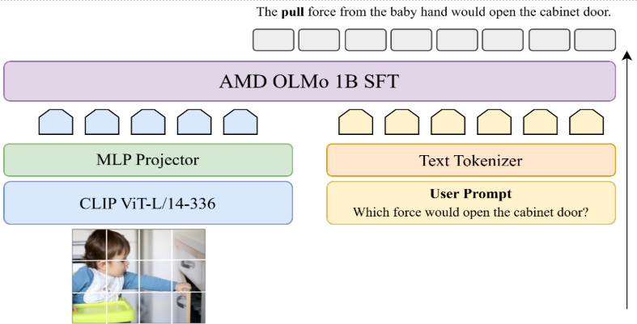
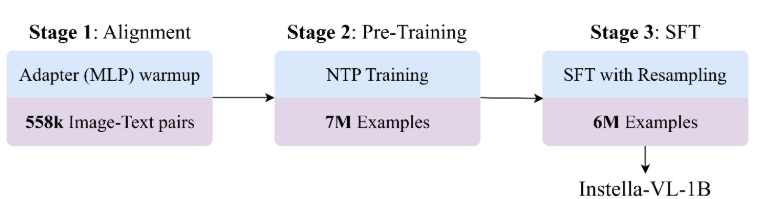

# Instella-VL-1B: First AMD Vision Language Model 
> **Core contributors**:
> Ximeng Sun, Aditya Kumar Singh, Gowtham Ramash, Zicheng Liu
> 
> **Contributors:**
> Pratik Prabhanjan Brahma, Ze Wang, Jiang Liu, Jialian Wu, Prakamya Mishra, Xiaodong Yu, Yusheng Su, Sudhanshu Ranjan, Emad Barsoum

We are thrilled to introduce Instella-VL-1B, the first AMD vision language model for image understanding trained on [AMD Instinct™ MI300X](https://www.amd.com/en/products/accelerators/instinct/mi300/mi300x.html) GPUs. Our journey with Instella-VL builds upon our previous 1-billion-parameter language models, [AMD OLMo SFT](https://huggingface.co/collections/amd/amd-olmo-6723e7d04a49116d8ec95070). We further extend the language model’s visual understanding abilities by connecting it with a vision encoder (which is initialized from [CLIP ViT-L/14-336](https://huggingface.co/openai/clip-vit-large-patch14-336)). During training, we jointly finetune vision encoder and language model with vision-language data in three stages: Alignment, Pretraining and Supervised-Finetuning (SFT). 

 

To build Instella-VL-1B, we created new data mixtures for both pretraining and SFT stages by combining [LLaVA](https://github.com/haotian-liu/LLaVA/blob/main/docs/Data.md), [Cambrian](https://huggingface.co/collections/nyu-visionx/cambrian-data-6667ce801e179b4fbe774e11), [Pixmo](https://huggingface.co/collections/allenai/pixmo-674746ea613028006285687b) and other datasets. Specifically, we enrich the model’s ability of document understanding by adopting richer document-related dataset such as [M-Paper](https://huggingface.co/datasets/mPLUG/M-Paper), [DocStruct4M](https://huggingface.co/datasets/mPLUG/DocStruct4M) and [DocDownstream](https://huggingface.co/datasets/mPLUG/DocDownstream-1.0). With our new pretraining dataset (7M examples) and SFT dataset (5M examples), our Instella-VL-1B significantly outperforms fully open-source models of similar sizes (such as [LlaVa-OneVision](https://llava-vl.github.io/blog/2024-08-05-llava-onevision/), [MiniCPM-V2](https://huggingface.co/openbmb/MiniCPM-V-2), etc.) on both general vision-language tasks and OCR-related benchmarks. It outperforms the open-weight model [InternVL2-1B](https://internvl.github.io/) on general benchmarks and achieves comparable results on OCR-related benchmarks.   


Adapted, and optimized for our hardware and model architecture from the [LLaVA](https://github.com/LLaVA-VL/LLaVA-NeXT)) codebase and trained exclusively with publicly available datasets, Instella-VL-1B represents our commitment to advancing open-source AI technology in multi-modal understanding with AMD MI300X GPUs. In line with our commitment to open source, we are sharing not only the model weights but also detailed training configurations, datasets, and [code](https://github.com/AMD-AIG-AIMA/AMD-LLaVA-NeXT/tree/instellavl). This enables the AI community to easily collaborate, replicate, and build upon our work, fostering innovation and accelerating progress. 

The model is now available on [HuggingFace](https://huggingface.co/AIG-GenAI/Instella-VL-1B), inviting the AI community to explore its capabilities, provide valuable feedback, and contribute to its continued development.  


### Key Takeaways:

- *Announcing Instella-VL-1B*, a vision language model trained on AMD Instinct MI300X GPUs. 

- Instella-VL-1B outperforms *fully open-source models* (e.g. [LlaVa-OneVision](https://llava-vl.github.io/blog/2024-08-05-llava-onevision/), [MiniCPM-V2](https://huggingface.co/openbmb/MiniCPM-V-2)) and many open-weight (e.g. [InternVL2-1B](https://internvl.github.io/), [Deepseek-VL](https://arxiv.org/abs/2403.05525)) with similar model scale on average general benchmarks (including [GQA](https://cs.stanford.edu/people/dorarad/gqa/evaluate.html), [ScienceQA](https://scienceqa.github.io/), [MMBench](https://mmbench.opencompass.org.cn/) and so on) and on par with InternVL2 for OCR related benchmarks such as [AI2D](https://prior.allenai.org/projects/diagram-understanding), [DocVQA](https://www.docvqa.org/), [Infographic-VQA](https://www.docvqa.org/datasets/infographicvqa), [ChartQA](https://github.com/vis-nlp/ChartQA).   

- *Fully open source* and *Reproducible*: Fully open-source release of model weights, training configurations, datasets, and code, fostering innovation and collaboration within the AI community. 

- ROCm™ compatible training optimizations: Leveraging techniques like *FlashAttention-2*, *Torch.Compile*, and *DeepSpeed Stage* 2/3 hybrid parallelism for distributed training.


Our motivation for building Instella-VL family of models is twofold:  

- *Demonstrate Training Capabilities of AMD Instinct™ accelerators*: By successfully training Instella-VL-1B from the ground up on these accelerators, we demonstrate their effectiveness and scalability for demanding AI workloads, establishing AMD hardware as a compelling alternative in the AI hardware market. 

- *Advancing Open-Source AI*: We're furthering our commitment to open-source AI by making the model fully transparent. Beyond sharing the model weights and datasets, we are also providing our training codebase, environment and hyperparameters for the community to reproduce our results. This full transparency allows the AI community to understand, replicate, and build upon our work. 

## Instella-VL-1B 


<div align="center">

<em><b>Figure 1:</b> Instella-VL-1B network architecture</em>
</div>

Instella-VL-1B is a 1.5B parameter multimodal model trained on AMD Instinct MI300X GPUs, combining a 300M parameter vision encoder and a 1.2B parameter language model 

### Model Architecture 

The model architecture integrates three key components: a *Vision Encoder* using [CLIP ViT-L/14@336](https://huggingface.co/openai/clip-vit-large-patch14-336) architecture featuring 24 layers, 16 attention heads and 1024 hidden size. The *Language Model* is based on [AMD OLMo 1B SFT](https://huggingface.co/amd/AMD-OLMo-1B-SFT) with 16 layers, 16 attention heads, and 2048 hidden size, and a *Projector* consisting of a 2-layer MLP designed to map the visual outputs to text tokens. 

### Hardware and Training Infrastructure 

Training was conducted with up to 4 nodes, totaling 32 GPUs, with each compute node comprising 8 AMD Instinct™ MI300X GPUs. Our training pipeline is based on an open-source LLaVA-NeXT codebase, which we adapted and optimized specifically for our hardware configuration and model architecture. For in-depth details regarding training hyperparameters and model inference, please refer to our [Hugging Face model card](https://huggingface.co/AIG-GenAI/Instella-VL-1B) and [Github repository(https://github.com/AMD-AIG-AIMA/AMD-LLaVA-NeXT)]. 


### Datasets

We build our training data with a mixture of LlaVa-OneVision-Data, Pixmo, mPLUG, M3IT, Cambrian, Cauldron and some small datasets. To ensure data diversity, we use a diverse collection of datasets from different domains ranging from general image-text caption pairs, OCR, Science, Math and Reasoning, Tables, Charts, Plots, and miscellaneous. For alignment stage, we use 558K examples from [BLIP558K](https://huggingface.co/datasets/liuhaotian/LLaVA-Pretrain). The full list of datasets across Pretraining and Instruction tuning along with their domains and number of examples are listed below: 

<!DOCTYPE html>
<html>
<head>
    <style>
        body {
            font-family: system-ui, -apple-system, sans-serif;
            max-width: 1200px;
            margin: 0 auto;
            padding: 20px;
        }
        h2 {
            color: #333;
            margin-top: 2em;
        }
        .resizable-container {
            position: relative;
            width: 100%;
            resize: horizontal;
            overflow: auto;
            min-width: 300px;
            max-width: 100%;
            padding: 0 8px 8px 0;
            margin-bottom: 2em;
            border: 1px solid #ddd;
        }
        .resizable-container::after {
            content: '';
            position: absolute;
            bottom: 0;
            right: 0;
            width: 10px;
            height: 10px;
            cursor: se-resize;
            background: linear-gradient(135deg, transparent 50%, #999 50%);
        }
        table {
            width: 100%;
            border-collapse: collapse;
            margin: 1em 0;
            background: white;
            box-shadow: 0 1px 3px rgba(0,0,0,0.1);
        }
        th, td {
            padding: 12px;
            text-align: left;
            border: 1px solid #ddd;
        }
        th {
            background-color: #f5f5f5;
            font-weight: 600;
            position: sticky;
            top: 0;
        }
        tr:nth-child(even) {
            background-color: #f9f9f9;
        }
        tr:hover {
            background-color: #f5f5f5;
        }
    </style>
</head>
<body>
    <h2>Pretraining Stage</h2>
    <div class="resizable-container">
        <table>
            <thead>
                <tr>
                    <th>Domain</th>
                    <th>Datasets</th>
                    <th>Num of Examples</th>
                </tr>
            </thead>
            <tbody>
                <tr>
                    <td>Image Captions</td>
                    <td><a href="https://huggingface.co/datasets/liuhaotian/LLaVA-Pretrain">BLIP150K</a>, <a href="https://huggingface.co/datasets/liuhaotian/LLaVA-Pretrain">COCO118K</a>, <a href="https://huggingface.co/datasets/lmms-lab/LLaVA-ReCap-CC3M">CC3M-Recap</a>, <a href="https://huggingface.co/datasets/allenai/pixmo-cap">Pixmo_Cap</a></td>
                    <td>3.52M</td>
                </tr>
                <tr>
                    <td>OCR</td>
                    <td><a href="https://huggingface.co/datasets/lmms-lab/LLaVA-OneVision-Mid-Data">SynthDog_EN</a>, <a href="https://huggingface.co/datasets/lmms-lab/LLaVA-OneVision-Mid-Data">SynthDog_ZH</a>, <a href="https://huggingface.co/datasets/lmms-lab/LLaVA-OneVision-Mid-Data">UReader</a>, <a href="https://rrc.cvc.uab.es/?ch=14&com=downloads">ART</a>, <a href="https://bgshih.github.io/cocotext/">COCO-Text</a>, <a href="https://github.com/google-research-datasets/hiertext">HierText</a>, <a href="https://s3-us-west-2.amazonaws.com/uber-common-public/ubertext/index.html">Uber-Text</a>, <a href="https://huggingface.co/datasets/lmms-lab/LLaVA-OneVision-Data">TextOCR</a>, <a href="https://github.com/openvinotoolkit/cvat">OpenVINO</a>, <a href="https://rrc.cvc.uab.es/?ch=8&com=downloads">MLT-17</a></td>
                    <td>913K</td>
                </tr>
                <tr>
                    <td>Documents</td>
                    <td><a href="https://huggingface.co/datasets/lmms-lab/LLaVA-OneVision-Data">DocVQA</a>, <a href="https://huggingface.co/datasets/mPLUG/DocStruct4M">DocStruct4M</a></td>
                    <td>410K</td>
                </tr>
                <tr>
                    <td>Table, Chart, and Plot</td>
                    <td><a href="https://github.com/vis-nlp/Chart-to-text/tree/main/pew_dataset/dataset/imgs">Chart2Text</a>, <a href="https://huggingface.co/datasets/ahmed-masry/unichart-pretrain-data">UniChart</a>, <a href="https://huggingface.co/datasets/lmms-lab/LLaVA-OneVision-Data">PlotQA</a>, <a href="https://huggingface.co/datasets/rootsautomation/RICO-WidgetCaptioning?row=0">WidgetCaption</a>, <a href="https://huggingface.co/datasets/rootsautomation/RICO-Screen2Words">Screen2Words</a>, <a href="https://huggingface.co/datasets/alexshengzhili/SciGraphQA-295K-train">SciGraphQA-295K</a>, <a href="https://zenodo.org/records/7299423#.Y2lzonbMKUl">Paper2Fig100K</a>, <a href="https://huggingface.co/datasets/xywang1/MMC/viewer/MMC-Instruction">MMC Instruction</a>, <a href="https://huggingface.co/datasets/mPLUG/M-Paper">M-Paper</a></td>
                    <td>1.97M</td>
                </tr>
                <tr>
                    <td>Text Only</td>
                    <td><a href="https://huggingface.co/datasets/lmms-lab/LLaVA-OneVision-Mid-Data/tree/main/evol_instruct">Evol-Instruct-GPT-4</a></td>
                    <td>70K</td>
                </tr>
            </tbody>
        </table>
        *Table 1: Datasets used during the pretraining stage of Instella-VL-1B, organized by domain with a total of 6.88M examples.*
    </div>
    <h2>Instruction-tuning Stage</h2>
    <div class="resizable-container">
        <table>
            <thead>
                <tr>
                    <th>Domain</th>
                    <th>Datasets</th>
                    <th>Num of Examples</th>
                </tr>
            </thead>
            <tbody>
                <tr>
                    <td>General</td>
                    <td><a href="https://huggingface.co/datasets/lmms-lab/LLaVA-OneVision-Data">AOKVQA, CLEVR, Hateful Memes, Image Textualization, OKVQA, ScienceQA, ShareGPT-4V, TallyQA, Visual7W, VizWiz, VQAv2, WebSight, ALLaVA Instruct, Cambrian, COCO Caption, IconQA, LLaVA-158K, LLaVAR, RefCOCO, ShareGPT-4O, Vision FLAN, VisText, VQARAD, VSR, InterGPS</a>, <a href="https://huggingface.co/datasets/MMInstruction/M3IT">Image-Paragraph-Captioning, ImageNet, COCO-GOI, COCO-ITM, Visual Dialog, SNLI-VE</a>, <a href="https://huggingface.co/datasets/nyu-visionx/Cambrian-10M/tree/main">Web-Landmark, Web-Celebrity, SAM, LAION-GPT-4V-Dataset, OODVQA</a>, <a href="https://huggingface.co/datasets/allenai/pixmo-cap">Pixmo_Cap</a>, <a href="https://huggingface.co/datasets/allenai/pixmo-count">Pixmo_Count</a>, <a href="https://huggingface.co/datasets/allenai/pixmo-points">Pixmo_Points</a>, <a href="https://huggingface.co/datasets/allenai/pixmo-ask-model-anything">Pixmo_Ask_Model_Anything</a>, <a href="https://huggingface.co/datasets/BAAI/SVIT">SVIT_Core_150K</a>, <a href="https://huggingface.co/datasets/HuggingFaceM4/the_cauldron">Localized Narratives</a></td>
                    <td>2.66M</td>
                </tr>
                <tr>
                    <td>Table, Chart, and Screen</td>
                    <td><a href="https://huggingface.co/datasets/lmms-lab/LLaVA-OneVision-Data">AI2D, ChartQA, DocVQA, FigureQA, InfographicVQA, RoBUT-SQA, RoBUT-WTQ, TQA, UReader IE, UReader QA, Chart2Text, Diagram Image2Text, DVQA, HiTab, LRV Chart, RoBUT WikiSQL, Screen2Words, UReader Caption, UReader KG, VisualMRC</a>, <a href="https://huggingface.co/datasets/mPLUG/TinyChartData">TinyChartData</a></td>
                    <td>866K</td>
                </tr>
                <tr>
                    <td>Documents</td>
                    <td><a href="https://huggingface.co/datasets/MMInstruction/ArxivQA">ArxivQA</a>, <a href="https://huggingface.co/datasets/mPLUG/DocDownstream-1.0">DocDownstream-1.0</a>, <a href="https://huggingface.co/datasets/mPLUG/DocReason25K">DocReason25K</a>, <a href="https://huggingface.co/datasets/mPLUG/DocStruct4M">DocStruct4M</a>, <a href="https://huggingface.co/datasets/allenai/pixmo-docs">Pixmo_Docs</a></td>
                    <td>522K</td>
                </tr>
                <tr>
                    <td>General OCR</td>
                    <td><a href="https://huggingface.co/datasets/lmms-lab/LLaVA-OneVision-Data">ChromeWriting, IIIT5K, K12 Printing, Rendered Text, TextCaps, HME100K, IAM, TextOCR-GPT-4V</a>, <a href="https://huggingface.co/datasets/lmms-lab/LLaVA-OneVision-Mid-Data">SynthDog-EN</a></td>
                    <td>84K</td>
                </tr>
                <tr>
                    <td>Math and Reasoning</td>
                    <td><a href="https://huggingface.co/datasets/lmms-lab/LLaVA-OneVision-Data">MAVIS Manual Collection, CLEVR-Math, Geo170K QA, GEOS, GeoMVerse, MapQA, Super-CLEVR, UniGeo, LRV Normal, Visual Genome, MAVIS Data Engine, Geo170K Align, Geometry3K, GeoQA+, TabMWP, GQA, RAVEN, MathVision, KVQA, VCR</a>, <a href="https://huggingface.co/datasets/HuggingFaceM4/the_cauldron">FinQA</a>, <a href="https://huggingface.co/datasets/nyu-visionx/Cambrian-10M/">Design2Code, IDK</a></td>
                    <td>460K</td>
                </tr>
                <tr>
                    <td>Others</td>
                    <td><a href="https://huggingface.co/datasets/MMInstruction/M3IT">IQA, MOCHEG, Shapes</a>, <a href="https://huggingface.co/datasets/nyu-visionx/Cambrian-10M/">ALFWorld, Q-Instruct-DB</a></td>
                    <td>479K</td>
                </tr>
                <tr>
                    <td>Text Only</td>
                    <td><a href="https://huggingface.co/datasets/lmms-lab/LLaVA-OneVision-Data">MathQA, Magpie Pro (L3 MT), Magpie Pro (Qwen2 ST), Magpie Pro (L3 ST)</a></td>
                    <td>480K</td>
                </tr>
            </tbody>
        </table>
        *Table 2: Datasets used during the instruction-tuning stage of Instella-VL-1B, organized by domain with a total of 5.55M examples.*
    </div>
</body>
</html>


## Training Recipe 

For training Instella-VL-1B model, we employed a training recipe similar to LlaVa-OneVision , where we trained our model in three stages: 1) Alignment stage for MLP warmup to establish initial connections between visual and language modalities, 2) Pre-training stage for developing robust multimodal representations across diverse domains, and finally 3) Instruction-tuning stage for enhancing the model's ability to follow complex instructions and perform specific tasks, as shown in Figure 2 


<div align="center">
<br>
<em><b>Figure 2:</b> Three-stage training process for Instella-VL-1B, progressing from Alignment with 558K image-text pairs to Pre-Training with 7M examples, and finally SFT with 6M resampled examples.</em>
</div>

### Stage 1: Alignment (MLP Warmup) 

In this stage, the focus is on warming up the Multi-Layer Perceptron (MLP) components of the model. This helps in mapping the visual output to the text input and sets a foundation for further learning. 

### Stage 2: Pretraining 

During this stage, the entire model undergoes pretraining using a Next-token prediction (NTP) objective on carefully curated datasets across multiple domains. *Image Captions* provide diverse real-world image-text pairs essential for building general vision-language understanding. We significantly expanded *OCR* training data to enhance text recognition capabilities and document formats for real-world applications. *Document Understanding* datasets were added to improve the model's ability to interpret complex document layouts and answer content-related questions. *Scientific and Technical Understanding* datasets strengthen the model's interpretation of technical visualizations and scientific figures, addressing growing academic and professional needs. *Text-Only* datasets maintain the language decoder's capabilities. This diverse collection helps the model learn representations across different visual and textual domains, preparing it for various downstream tasks. 

### Stage 3: Instruction Tuning 


Instruction Tuning builds upon the pretraining foundation by enhancing the model's instruction-following capabilities through tuning on domain-spanning datasets. *General Vision-Language Tasks* expand beyond basic image-caption pairs to include complex visual reasoning, question answering, and multimodal understanding tasks for real-world applications. *Technical/Scientific Tasks* emphasize charts, diagrams, and scientific figures to improve the model's interpretation and reasoning abilities. *OCR and Text Recognition* datasets covering diverse scenarios refine the model's understanding of numbers, legends, tables, and text. *Document Analysis* enhances OCR capabilities and document understanding, allowing the model to locate specific answers within documents or provide concise summaries by filtering non-essential information. *Mathematical and Logical Reasoning* datasets develop comprehensive capabilities in mathematics, geometry, and logical problem-solving. Based on error analysis, we oversampled specific training datasets ([ScienceQA](https://proceedings.neurips.cc/paper_files/paper/2022/file/11332b6b6cf4485b84afadb1352d3a9a-Paper-Conference.pdf), [AI2D](https://link.springer.com/chapter/10.1007/978-3-319-46493-0_15), [PMC-VQA](https://arxiv.org/pdf/2305.10415.pdf), [Cambrian](https://arxiv.org/abs/2406.16860), and [TQA](https://openaccess.thecvf.com/content_cvpr_2017/papers/Kembhavi_Are_You_Smarter_CVPR_2017_paper.pdf)) by approximately twice to strengthen the model's understanding of science-based and general reasoning questions. 

## Results:

<!DOCTYPE html>
<html>
<head>
    <style>
        table {
            border-collapse: collapse;
            width: 100%;
            font-family: system-ui, -apple-system, sans-serif;
            font-size: 14px;
        }
        th, td {
            border: 1px solid #ddd;
            padding: 8px;
            text-align: left;
        }
        th {
            background-color: #f5f5f5;
            font-weight: 600;
        }
        .section-header {
            background-color: #f0f0f0;
            font-weight: bold;
        }
        .numeric {
            text-align: right;
        }
        .model-name {
            font-weight: 500;
        }
        .benchmark-section {
            background-color: transparent;
        }
        .ocr-section {
            background-color: transparent;
        }
    </style>
</head>
<body>
    <table>
        <thead>
            <tr>
                <th>Model Name</th>
                <th>Vision Encoder</th>
                <th>Text Encoder</th>
                <th>Num. Params</th>
                <th colspan="8" class="benchmark-section">General Benchmarks</th>
                <th class="benchmark-section">Average</th>
                <th colspan="6" class="ocr-section">OCR, Chart and Doc Understanding</th>
                <th class="ocr-section">Average</th>
            </tr>
            <tr>
                <th></th>
                <th></th>
                <th></th>
                <th></th>
                <th class="benchmark-section">GQA</th>
                <th class="benchmark-section">SQA</th>
                <th class="benchmark-section">POPE</th>
                <th class="benchmark-section">MM-Bench</th>
                <th class="benchmark-section">SEED-Bench</th>
                <th class="benchmark-section">MMMU</th>
                <th class="benchmark-section">RealWorldQA</th>
                <th class="benchmark-section">MMStar</th>
                <th class="benchmark-section"></th>
                <th class="ocr-section">OCRBench</th>
                <th class="ocr-section">TextVQA</th>
                <th class="ocr-section">AI2D</th>
                <th class="ocr-section">ChartQA</th>
                <th class="ocr-section">DocVQA</th>
                <th class="ocr-section">InfoVQA</th>
                <th class="ocr-section"></th>
            </tr>
        </thead>
        <tbody>
            <tr class="section-header">
                <td colspan="20">Open Weight Models</td>
            </tr>
            <tr>
                <td class="model-name">DeepSeek-VL-1.3B</td>
                <td>SigLIP</td>
                <td>DeepSeek-LLM-1B</td>
                <td class="numeric">1.4B</td>
                <td class="numeric">--</td>
                <td class="numeric">64.52</td>
                <td class="numeric">85.80</td>
                <td class="numeric">64.34</td>
                <td class="numeric">65.94</td>
                <td class="numeric">28.67</td>
                <td class="numeric">50.20</td>
                <td class="numeric">38.30</td>
                <td class="numeric">--</td>
                <td class="numeric">41.40</td>
                <td class="numeric">57.54</td>
                <td class="numeric">51.13</td>
                <td class="numeric">47.40</td>
                <td class="numeric">35.70</td>
                <td class="numeric">20.52</td>
                <td class="numeric">42.28</td>
            </tr>
            <tr>
                <td class="model-name">InternVL2-1B</td>
                <td>InternViT</td>
                <td>Qwen2-0.5B</td>
                <td class="numeric">1B</td>
                <td class="numeric">55.06</td>
                <td class="numeric">89.54</td>
                <td class="numeric">87.40</td>
                <td class="numeric">61.70</td>
                <td class="numeric">65.90</td>
                <td class="numeric">32.40</td>
                <td class="numeric">51.90</td>
                <td class="numeric">46.18</td>
                <td class="numeric">61.26</td>
                <td class="numeric">74.40</td>
                <td class="numeric">69.60</td>
                <td class="numeric">62.40</td>
                <td class="numeric">71.52</td>
                <td class="numeric">80.94</td>
                <td class="numeric">46.30</td>
                <td class="numeric">67.53</td>
            </tr>
            <tr>
                <td class="model-name">InternVL2.5-1B</td>
                <td>InternViT</td>
                <td>Qwen2-0.5B-instruct</td>
                <td class="numeric">1B</td>
                <td class="numeric">56.66</td>
                <td class="numeric">93.90</td>
                <td class="numeric">89.95</td>
                <td class="numeric">68.40</td>
                <td class="numeric">71.30</td>
                <td class="numeric">35.60</td>
                <td class="numeric">58.30</td>
                <td class="numeric">47.93</td>
                <td class="numeric">65.26</td>
                <td class="numeric">74.20</td>
                <td class="numeric">72.96</td>
                <td class="numeric">67.58</td>
                <td class="numeric">75.76</td>
                <td class="numeric">82.76</td>
                <td class="numeric">53.62</td>
                <td class="numeric">71.15</td>
            </tr>
            <tr class="section-header">
                <td colspan="20">Open Weight, Open Data Models</td>
            </tr>
            <tr>
                <td class="model-name">TinyLLaVA-2.4B</td>
                <td>SigLIP</td>
                <td>Gemma</td>
                <td class="numeric">2.4B</td>
                <td class="numeric">61.58</td>
                <td class="numeric">64.30</td>
                <td class="numeric">85.66</td>
                <td class="numeric">58.16</td>
                <td class="numeric">63.30</td>
                <td class="numeric">32.11</td>
                <td class="numeric">52.42</td>
                <td class="numeric">37.17</td>
                <td class="numeric">56.84</td>
                <td class="numeric">28.90</td>
                <td class="numeric">47.05</td>
                <td class="numeric">49.58</td>
                <td class="numeric">12.96</td>
                <td class="numeric">25.82</td>
                <td class="numeric">21.35</td>
                <td class="numeric">30.94</td>
            </tr>
            <tr>
                <td class="model-name">TinyLLaVA-1.5B</td>
                <td>SigLIP</td>
                <td>TinyLlama</td>
                <td class="numeric">1.5B</td>
                <td class="numeric">60.28</td>
                <td class="numeric">59.69</td>
                <td class="numeric">84.77</td>
                <td class="numeric">51.28</td>
                <td class="numeric">60.04</td>
                <td class="numeric">29.89</td>
                <td class="numeric">46.67</td>
                <td class="numeric">31.87</td>
                <td class="numeric">53.06</td>
                <td class="numeric">34.40</td>
                <td class="numeric">49.54</td>
                <td class="numeric">43.10</td>
                <td class="numeric">15.24</td>
                <td class="numeric">30.38</td>
                <td class="numeric">24.46</td>
                <td class="numeric">32.85</td>
            </tr>
            <tr>
                <td class="model-name">LLaVA-OneVision-1B</td>
                <td>SigLIP</td>
                <td>Qwen2-0.5B</td>
                <td class="numeric">0.9B</td>
                <td class="numeric">57.95</td>
                <td class="numeric">59.25</td>
                <td class="numeric">87.17</td>
                <td class="numeric">44.60</td>
                <td class="numeric">65.43</td>
                <td class="numeric">30.90</td>
                <td class="numeric">51.63</td>
                <td class="numeric">37.38</td>
                <td class="numeric">54.29</td>
                <td class="numeric">43.00</td>
                <td class="numeric">49.54</td>
                <td class="numeric">57.35</td>
                <td class="numeric">61.24</td>
                <td class="numeric">71.22</td>
                <td class="numeric">41.18</td>
                <td class="numeric">53.92</td>
            </tr>
            <tr>
                <td class="model-name">MiniCPM-V-2</td>
                <td>SigLIP</td>
                <td>MiniCPM-2.4B</td>
                <td class="numeric">2.8B</td>
                <td class="numeric">--</td>
                <td class="numeric">76.10</td>
                <td class="numeric">86.56</td>
                <td class="numeric">70.44</td>
                <td class="numeric">66.90</td>
                <td class="numeric">38.55</td>
                <td class="numeric">55.03</td>
                <td class="numeric">40.93</td>
                <td class="numeric">--</td>
                <td class="numeric">60.00</td>
                <td class="numeric">74.23</td>
                <td class="numeric">64.40</td>
                <td class="numeric">59.80</td>
                <td class="numeric">69.54</td>
                <td class="numeric">38.24</td>
                <td class="numeric">61.04</td>
            </tr>
            <tr>
                <td class="model-name">Instella-VL-1B</td>
                <td>CLIP</td>
                <td>AMD OLMO 1B SFT</td>
                <td class="numeric">1.5B</td>
                <td class="numeric">61.52</td>
                <td class="numeric">83.74</td>
                <td class="numeric">86.73</td>
                <td class="numeric">69.17</td>
                <td class="numeric">68.47</td>
                <td class="numeric">29.30</td>
                <td class="numeric">58.82</td>
                <td class="numeric">43.21</td>
                <td class="numeric">62.62</td>
                <td class="numeric">67.90</td>
                <td class="numeric">71.23</td>
                <td class="numeric">66.65</td>
                <td class="numeric">72.52</td>
                <td class="numeric">80.30</td>
                <td class="numeric">46.40</td>
                <td class="numeric">67.50</td>
            </tr>
        </tbody>
    </table>
</body>
</html>
*Table: Comparison of Multimodal Vision-Language Models on Various Benchmarks*


We use [lmms-eval](https://github.com/EvolvingLMMs-Lab/lmms-eval) to evaluate model performance. Instella-VL-1B demonstrates better performance compared to fully open-source models, with substantial margins across key benchmarks. Specifically, it achieves ⬆️5.78% higher General Benchmarks Average (62.62% vs 56.84%) over TinyLLaVA-2.4B despite only using 62.5% parameters. In OCR, Chart and Document Understanding tasks, Instella-VL-1B shows even more impressive gains, with 67.50 vs 30.94 compared to TinyLLaVA-2.4B and ⬆️6.46% improvement (67.50% vs 61.04%) over MiniCPM-V-2. 

When compared to open-weight models like InternVL2.5-1B, Instella-VL-1B maintains competitive performance, achieving comparable scores in both general benchmarks (62.62 vs 65.26) and document understanding tasks (67.50 vs 71.15), while matching the parameter efficiency at 1-1.5B parameters. 

## Conclusion

The release of Instella-VL-1B represents a significant milestone as AMD's first vision language model, demonstrating the capabilities of [AMD Instinct™ MI300X](https://www.amd.com/en/products/accelerators/instinct/mi300/mi300x.html) GPUs for large-scale vision-language training. Outperforming comparable fully open-source models while remaining competitive with open-weight alternatives. Instella-VL-1B showcases the effectiveness of our training recipe with carefully curated publicly available datasets. 

By fully open-sourcing this model—including weights, training/dataset details, and code—we aim to foster innovation and collaboration within the AI community. We believe that transparency and accessibility are key drivers of progress in AI research. We invite developers, researchers, and AI enthusiasts to explore Instella-VL-1B and contribute to its ongoing improvement. 

## Links / Additional resources

**Model Cards:**
Hugging Face: https://huggingface.co/AIG-GenAI/Instella-VL-1B 

**Code:**
Github: https://github.com/AMD-AIG-AIMA/AMD-LLaVA-NeXT/tree/instellavl 

Please refer to the following blogs to get started with using these techniques on AMD GPUs:
- [Multimodal (Visual and Language) understanding with LLaVA-NeXT](https://rocm.blogs.amd.com/artificial-intelligence/llava-next/README.html)
- [Accelerating Large Language Models with Flash Attention on AMD GPUs](https://rocm.blogs.amd.com/artificial-intelligence/flash-attention/README.html)
- [Accelerate PyTorch Models using torch.compile on AMD GPUs with ROCm™](https://rocm.blogs.amd.com/artificial-intelligence/torch_compile/README.html)

## Bias, Risks, and Limitations
- The models are being released for research purposes only and are not intended for use cases that require high levels of factuality, safety critical situations, health, or medical applications, generating false information, facilitating toxic conversations. 
- Model checkpoints are made accessible without any safety promises. It is crucial for users to conduct comprehensive evaluations and implement safety filtering mechanisms as per their respective use cases. 
- It may be possible to prompt the model to generate content that may be factually inaccurate, harmful, violent, toxic, biased, or otherwise objectionable. Such content may also get generated by prompts that did not intend to produce output as such. Users are thus requested to be aware of this and exercise caution and responsible thinking when using the model. 
- Multi-lingual abilities of the models have not been tested and thus may misunderstand and generate erroneous responses across different languages.

## Citations
Feel free to cite our Instella-VL-1B model:
```
@misc{Instella-VL-1B, 
    title = {Instella-VL-1B-1.0: AMD’s first Vision language model}, 
    url = {https://huggingface.co/AIG-GenAI/Instella-VL-1B}, 
    author = {Ximeng Sun, Aditya Singh, Gowtham Ramesh, Jiang Liu, Ze Wang, Sudhanshu Ranjan, Pratik Brahma, Prakamya Mishra,  Jialian Wu, Xiaodong Yu, Yusheng Su, Emad Barsoum, Zicheng Liu}, 
    month = {March}, 
    year = {2025} 
} 
```
## Disclaimers

Third-party content is licensed to you directly by the third party that owns the
content and is not licensed to you by AMD. ALL LINKED THIRD-PARTY CONTENT IS
PROVIDED “AS IS” WITHOUT A WARRANTY OF ANY KIND. USE OF SUCH THIRD-PARTY CONTENT
IS DONE AT YOUR SOLE DISCRETION AND UNDER NO CIRCUMSTANCES WILL AMD BE LIABLE TO
YOU FOR ANY THIRD-PARTY CONTENT. YOU ASSUME ALL RISK AND ARE SOLELY RESPONSIBLE
FOR ANY DAMAGES THAT MAY ARISE FROM YOUR USE OF THIRD-PARTY CONTENT.